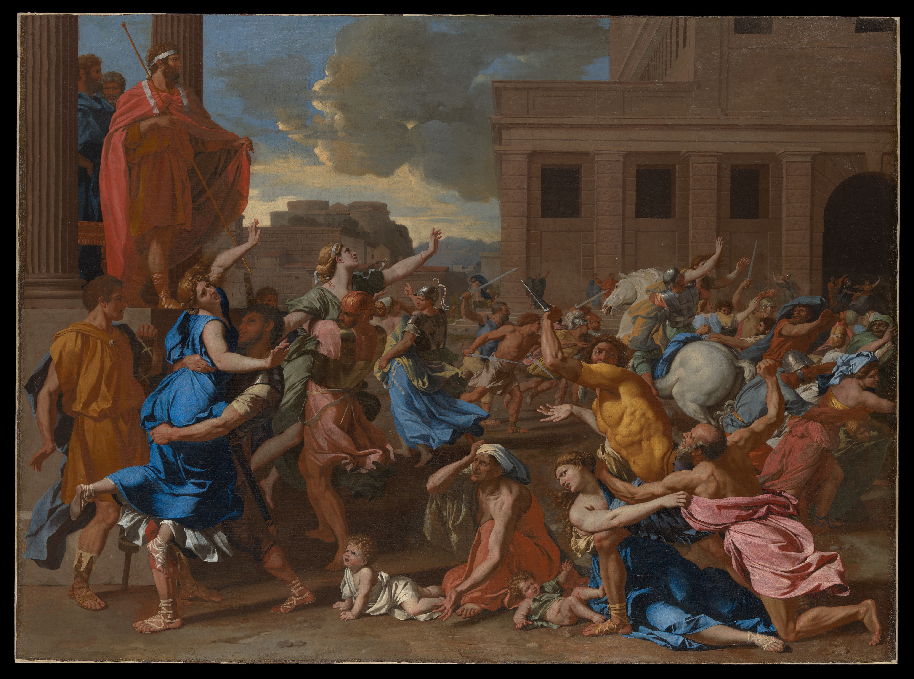

Pedro Schacht
02.03.10  
Apreciador da Arte. Escrevo sobre a 7ª no [Letterboxd](https://boxd.it/bgsVh)

---

## Música

**Álbuns favoritos:**  
- A Tribe Called Quest - *The Low End Theory* 
- Godspeed You! Black Emperor - *Lift Your Skinny Fists Like Antennas to Heaven* / F♯ A♯ ∞ (ambas versoes)
- (E quase todos do Kanye West)

**Gêneros favoritos:**  
hiphop / jazz rap  
Post-Rock  
MPB

[Last.fm](https://www.last.fm/user/pedroschacht)

---

## Cinema

**Diretor favorito:** Alfred Hitchcock

**Filmes favoritos:**  
- Deep End (1970) Directed by Jerzy Skolimowski  
- Vertigo (1958) Directed by Alfred Hitchcock  
- Il Sorpasso (1962) Directed by Dino Risi

[Letterboxd](https://boxd.it/bgsVh)
